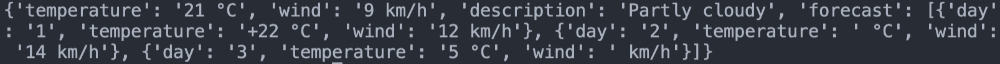
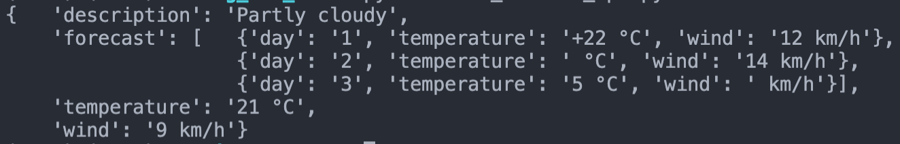
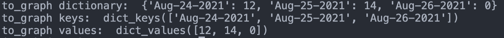
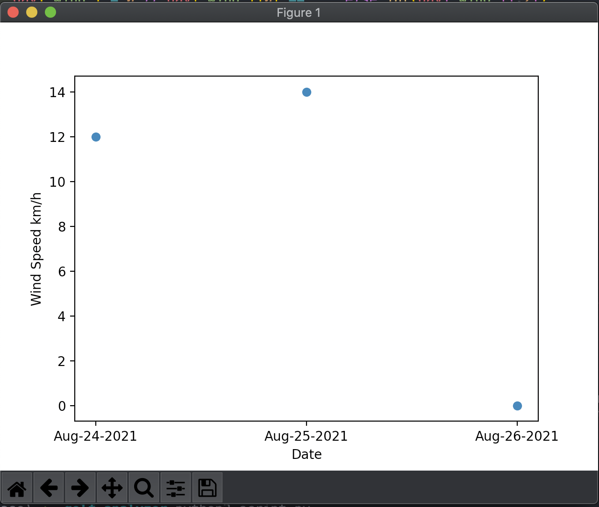

# Activity: Analyze the Best Golf Day

In today's activity, we take on the role of a passionate golfer: someone obsessed with the numbers and science of the game, always dedicated to swinging a club on the most ideal, most pleasant day of the week. We will be building a python application that allows us to determine, based on forecast windspeed, the finest day to play golf in the near future.

Starter files for your solution are in the [Activity_3_Best_Golf_Day](./Activity_3_Best_Golf_Day/) directory.

## 1. Establishing a Virtual Environment

To get started, open your terminal and navigate to where you have been storing your Python projects. Inside, generate a new directory called using_packages, or something of that nature. Then, navigate into that folder.

Once you're inside of your project folder, you are ready to instantiate a virtual environment. To do so, in your terminal, enter the following command:

```powershell
python3 -m venv venv
```

**Remember: The second "venv" is the name of your virtual environment! Typically, naming it "venv" is good practice, but you could name it anything you want to. Just know to change the second "venv" to whatever you named your environment!**

Run the `ls` command now. If successful, you should have a file called venv in your directory. Don't worry about exploring that file for just now: this file will be storing all the necessary data that will be unique to your virtual environment.

Now that your virtual environment has been built, you'll need to activate it. Do so by entering into your terminal:

```powershell
source venv/bin/activate
```

Upon doing so, you should see a change in your terminal, it may indicate that you are now inside of a virtual environment! Now, any dependencies we install will install to our virtual environment instead of our computer's global python shell.

Before moving on, we should add a `gitignore` file and make sure to reference our venv file inside of it.

- Create a .gitignore file
- The content inside should simply be `venv`

## 2. Using PIP

Next up, we need to install the dependencies that will form the core functionality of our application:

- `requests` - Will allow us to make HTTP requests to our REST API
- `matplotlib` - Will build our extremely-important graph to visualize which day will be the best for golf. Quantifiably!

To install these dependencies, simply run the following code in your terminal:

```powershell
pip3 install matplotlib requests
```

Once the packages have been installed, type ls into your terminal once again. What has changed? Nothing? That's right! When we work with external packages in Node.js, we automatically generate a package.json file that has a directory of all of our dependencies. At this stage, if we were to post our code on github, contributors would have no idea what dependencies they would need in order to get the code to work! That's a problem!

Luckily, Pip has a handy fix for that exact problem. Enter the following command in your terminal:

```powershell
pip freeze > requirements.txt
```

The pip freeze command will post a directory of all of your external packages and the versions that they are on inside of a text file! Whenever you clone an external python project, you can easily install all of the dependencies from the included requirements.txt file by simply running:

```powershell
pip install -r requirements.txt
```

Excellent work! With that all out of the way, we're ready to write some code.

## 3. Requesting API Data

Now that we have all of our external packages installed, create a file called script.py. We will be building all of our logic in this file.

Add the following code to `script.py`:

```python
import pprint
import requests
from matplotlib import pyplot as plt
from datetime import datetime
```

**Hey, what gives! Why is the import syntax different for the bottom two? Great question! We are importing just specific modules from those packages. From matplotlib we are just importing the module that supports drawing a graph, and from datetime we are importing the module that allows us to access the current time! The other two, however, we are importing the entire package.**

Next up, we need to make a request to our API using the requests package. Similarly to the axios package for Node.js, requests is fairly simple to implement and can handle RESTful request patterns handily. Just like when we fetch API data with JavaScript, we will need to convert our response object to json.

Add the following code to your script:

```python
import pprint
import requests
from matplotlib import pyplot as plt
from datetime   import datetime

API_URL  = 'https://weather-api-node-wisc.herokuapp.com/weather/'
cityName = 'seattle' # feel free to enter your own city here!
request  = requests.get(API_URL + city)
response = request.json()

print(response)
```

Now feel free to run your code! Let's see what this API is returning.

**The API should have successfully returned weather data inside of an object, but it is not easily read.**


Add the following code to your script to polish up that return and make it a touch easier to read:

```python
import pprint
import requests
from matplotlib import pyplot as plt
from datetime   import datetime

API_URL  = 'https://weather-api-node-wisc.herokuapp.com/weather/'
cityName = 'seattle' # feel free to enter your own city here!
request  = requests.get(API_URL + city)
response = request.json()

# here we are formatting the PrettyPrinter. Try using different indents!
pp = pprint.PrettyPrinter(indent=4)
pp.pprint(response)
```

Expected return:

**After implementing PrettyPrinter, our json response looks more readable with correct code-indenting.**


**Now that's what I call pretty printing.**

## 4. Shaping the Data for Graphing

Now, we have some great looking data coming back from the API. If we read over it closely, we might notice that the forecast array stores the next three days of forecasted temperature and, most importantly, wind speed!

**We're going off of the assumption that wind speed is more important than temperature in golf. For science.**

Really and truly, that's the data we are interested in. The description, temperature, and wind fields are unnecessary for our purposes, as if the weather were good today, we would already be golfing.

Before we can toss our data straight into Matplotlib, we need to make sure that it is in the shape the package is expecting. Given our purposes, we are going to use a scatter plot, so that we can clearly identify which days have the least wind. To do so, we need to form a list for each axis we want to observe. In this case:

- The date
- The wind speed

And with python, this will be a breeze!

First, let's hone down our API results to just the forecast list, and use datetime to find out what day today is.

Add the following code to `script.py`.

```python
forecast_list = response['forecast']
today = datetime.now().strftime("%b-%d-%Y")
```

Next, we should develop a dictionary to store our two axes. We'll call this dictionary to_graph. Ultimately, we will expect to format our dictionary to store each day's date as a key, and the wind speed as the value. But for now, we can just instantiate an empty dictionary.

Add the following to your `script.py`.

```python
to_graph = {} # The empty dictionary to store our shaped data
count    = 1  # A global iterator to track each day past current datetime

for day in forecast_list:
    current_date = int(today[4:6]) + count
    this_day = f"{today[0:4]}{current_date}{today[6:]}"
    count += 1

    to_graph[this_day] = day['wind']

print(to_graph)

# expected output should look something like:
#   {'Aug-24-2021': 12,
#    'Aug-25-2021': 14,
#    'Aug-26-2021': 0 }
```

If you have your output returning a dictionary with integer values representing wind speed, excellent work! You have everything you need to generate a graph.

## 5. Implementing the Graph

Finally, let's see if our hard work has paid off. When working with a package like matplotlib, most of the hard work is simply finding the data you want to plot, and finding a programmatic way of shaping it for a graph. Because we have already done that, we only have to call on the graph, label the axes, and print it to the screen!

Let's start with our labels. Add the following code to your script:

```python
# Remember to always label the axes of your graph!
plt.xlabel('Date')
plt.ylabel('Wind Speed km/h')
```

Next, we need to call on the graph type that we intend on using. In this case, as mentioned above, we are going to use the Scatter plot. This graph takes two lists as mandatory arguments to create the x and y axes, respectively. "But... We don't have any usable lists right now" I hear you saying! No need to worry, it is very easy to convert a dictionary into a pair of lists. Try adding the following code and running your script:

```python
print('to_graph keys: ',   to_graph.keys())
print('to_graph values: ', to_graph.values())
```

**The expected return of printing our graph's keys and values should display two usable lists.**


Excellent! We have two beautiful lists ready to be plotted. One last step and we're ready to go! Add the following code to your script:

```python
plt.scatter(to_graph.keys(), to_graph.values()) # sets up the graph
plt.show() # paints the graph to your screen
```

**Our scatter plot now shows 3 points of data, displaying the most optimal day for golfing.**


Now that's what I call glorious golf graphing! Surely we can now use this as our cutting-edge to get the most excellent tee-times. Who knew a little computer snake could accomplish so much!

*Code broken?* Get lost at some point along the way? That's okay! Solution code is available in the [Activity_3_Best_Golf_Day_Solution](./Activity_3_Best_Golf_Day_Solution/) directory.

## Bonus

Thirsty for more? If you've finished this activity and still have time, try practicing your Python skills a little bit more by adding some of the following features!

- Currently, if we were to start a search on one of the last 2 days of the month, our dates will look screwy, potentially going beyond the confines of agreed-upon datetime. How could you resolve the edge-cases that could cause these errors?
- Try adapting our script to display a bar graph of the temperatures of the next three days
- Sometimes the API returns unclean data, looking like: ' km / h' for the wind speed on any given day. Adapt your code to handle this event. Assume if wind speed is not posted, the wind speed will be 0.
