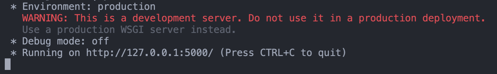
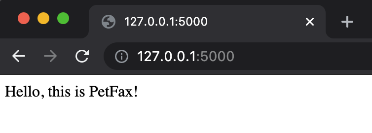

# Activity: PetFax Introduction: Flask Installation

We have been asked by a local animal shelter to create an application that shares fun animal facts alongside photos of the animals available for adoption. They hope this will be a fun way to get potential adoptees to engage with the shelter and find the animals loving new homes.

They just want us to create a proof of concept so let's use this opportunity and use a whole new stack to build the application. We will use Python and Flask, and no database for this initial sample. All the activities for Day 5 will use the PetFax directory.

They have given us some data to play around with, so let's get started!

## Setup

The files are located in the [Day5/PetFax](../PetFax/) directory. It has a JSON file and images. Open the [pets.json](../PetFax/pets.json) file and take a second to analyze the data structure. We won't use it for a little while, but it is still good to look it over before starting.

## Installing Flask

Before we can get started, we have to install the Flask package. However, in order to do so we first need to create a virtual environment to help manage the dependencies for this particular project.

**In terminal:**

1. Make sure you are in the root of the petfax-app project.
2. Using Python 3 built-in `venv` model, create a virtual environment and name the directory venv.
3. Once the virtual environment directory is created, `activate` it.
   - Reminder: To later disconnect from the virtual environment, you can use the `deactivate` command.

**What your terminal commands should look like:**

MacOS

```powershell
python3 -m venv venv
. venv/bin/activate
```

Windows

```powershell
python3 -m venv venv
& .\venv\Scripts\Activate.ps1
```

**In terminal:**

1. Make sure your virtual enviroment was successfully started. You should see venv or something similar in terminal.
2. With our virtual environment set up, we can now install the Flask package with pip.

**What your terminal commands should look like:**

```powershell
pip install Flask
```

## Create a Simple Flask Application

Before we get started with PetFax in earnest, let's get our bearings with this new framework first by creating a simple `GET` route. This way, we can be sure we have set everything up and have Flask working correctly before we dive into things.

By default, Flask assumes a basic entry point file will be named `app.py`. In most cases if there is no file named that way, it will not run. You can specify your entry file name when running the app if you desire a different name, but it is much easier to just use the default. For now, we will make a file named `app.py` so we can easily practice.

**In terminal:**

1. Create a file named `app.py`
2. Open the file in your code editor.
3. In `app.py`, import the Flask package as `flask`.
4. Create an `app` instance from Flask. Be sure to pass it the special dunder variable `__name__`

**What your `app.py` should look like:**

```python
# config
from flask import Flask
app = Flask(__name__)
```

Great, we have now created a Flask app! Of course, it doesn't do very much right now. Let's give it something to do by writing a simple `GET` route.

**In `app.py`:**

1. As we just learned, to create a route we need to call `.route()` on the app instance.
2. The method expects at least one argument specifying what endpoint to use for the route. Let's just have it go to `/`
3. To tell our route what to do when that endpoint is used, we need to define a method directly underneath it. Let's name our method `index`
4. Have the method simply return a string that says `Hello, this is PetFax!`

**What your code should look like:**

```python
# config
from flask import Flask
app = Flask(__name__)

# index route
@app.route('/')
def index():
    return 'Hello, this is PetFax!'
```

## Running a Flask Application

Great! We now have a small Flask app that just returns a string on the base index route. Now what? How exactly do we a run a Flask application? Thinking back, for Node.js apps, we could use `npm run`. Thankfully, Flask has a very similar command: `flask run`.

Wait! You may have noticed that we didn't specify a port anywhere for our app to listen on. Do we need to? Nope! By default, Flask will run on port 5000, so we don't have to. Let's try it out then!

```powershell
flask run
```

If successful, you should see some messages in terminal telling you it is running on port 5000. You should also be able to go to port 5000 in your browser (at [http://127.0.0.1:5000/](http://127.0.0.1:5000/)) and see the string that we wrote.

**In terminal:**



**In the browser:**



## Running a Flask Application with Reloading

For testing purposes, let's go ahead and make a second route.

In `app.py`:

1. Underneath the index route we just wrote, create another one that goes to `/pets`
2. Define a method for this route called `pets`
3. Have the method simply return another string, this time saying `These are our pets available for adoption!`

**What your code should look like:**

```python
# pets index route
@app.route('/pets')
def pets():
    return 'These are our pets available for adoption!'
```

Our app is already running, so in theory we should just be able to check out this new route we created in the browser immediately.

Try it out by going to [http://127.0.0.1:5000/pets](http://127.0.0.1:5000/pets)

Uh-oh! That is not what we want, and it doesn't make sense either. We definitely have a route that goes to `/pets`, so why isn't this working?

This happens because `flask run` does not automatically restart when a file changes. To apply any changes made after the initial run, you would have to manually stop and restart the server.

That can become tedious, of course, but thankfully there is a way around that. We simply have to use the `--reload` flag when running the command. That will make Flask automatically restart when a file has been changed. Try it out and then make a small change in either of your routes.

```powershell
flask run --reload
```

## Conclusion

As we have just experienced, starting a basic Flask application is incredibly simple, fast, and lightweight. That is one of the biggest benefits of using a micro framework.

Of course, such a small app isn't very useful, nor would it be very scalable to simply put all your routes on a single-entry file. In the next lesson, we will learn about some ways to better structure our application-and we will truly get started on PetFax!
