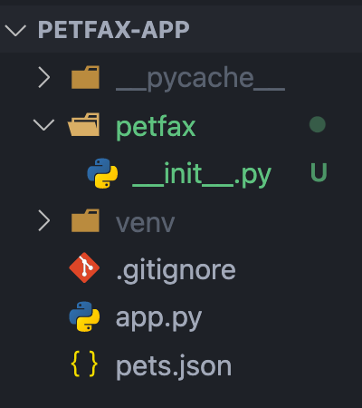

# Activity: Following the Application Factory Pattern

In the last activity, we started working on PetFax. We set up Flask to ensure we were able to get it working. In this activity, we will reorganize our app to be a little more robust and scale-friendly before we really dig into it.

## Getting Started

1. Open your terminal.
2. Navigate to [Day5/PetFax](../PetFax).
3. Open it in your code editor of choice.
4. Create the virtual environment if it does not exist.
   - `python3 -m venv venv`
5. Activate the virtual environment by running the command below for your operating system.
   - MacOS -> `. venv/bin/activate`
   - Windows -> `& .\venv\Scripts\Activate.ps1`
6. Run the app with `flask run --reload`.

## Create the Application Factory

The first step to reorganizing our project is to create the application factory. As we learned, we essentially want to make our application a package to be imported into the entry file. As such, we need to create a nested project folder that contains an `__init__.py` file. Let's start with that.

**In terminal**

1. Make sure you're in the root of `petfax-app`.
2. Make a new directory called `petfax`.
3. Inside that new directory, touch an `__init__.py` file.

**What your file structure should look like**



With the file structure set up, we can now work on the actual application factory. The `__init__.py` file is where we want to initially configure Flask and write the function that will create the instance of our app. Let's do that.

### `__init__.py`

1. At the top of the file, import the flask package as Flask.
2. Define a function that will be our application factory. Let's call it create_app.
3. Inside that function, create a new app instance of Flask.
4. Still inside the function, create a basic index route that goes to '/' and just returns 'Hello, PetFax!' as a string.
5. Lastly, don't forget to return the app instance at the end of the factory.

**What your code should look like**

```python
from flask import Flask

def create_app():
    app = Flask(__name__)

    @app.route('/')
    def hello():
        return 'Hello, PetFax!'

    return app
```

Aside from creating the function and writing our app configuration within it, all of that should feel familiar. In fact, if you open up the `app.py` file we previously wrote, you'll see it looks nearly identical.

However, that now leaves us with duplicate code. We no longer need the Flask configuration and routes inside the `app.py` file since our `__init__.py` handles it instead. Let's get rid of it.

### `app.py`

1. Delete everything in the file.
2. As the __init__.py configures everything, we can now import the petfax folder as a package.
3. Specifically, we want to import the application factory function that we wrote. Import create_app from the petfax folder.
4. Now that we have access to the factory function, we can create an app instance in app.py by invoking the function and saving it to a variable called app.
5. Test that everything's still working as intended by running flask run --reload

**What your code should look like**

```python
from petfax import create_app
app = create_app()
```

**Note: Creating a global app instance with the application factory is different from creating it directly with Flask. Here, we're creating the app instance with all our custom logic already loaded into it.**

## Conclusion

We've now successfully reorganized our Flask application! However, it still doesn't do much. We learned about how to accept other HTTP methods for our routes, but we can't put it into play just yet. This is because we have no views. As this isn't an API, there's no way a user could POST without a new page, for example.

Additionally, our main reason for reorganizing to follow the application factory pattern is to take advantage of separating logic into different files. In other words, we want to be able to write something like the controllers in Express.

In the next lesson, we'll learn how to do both of those things!
