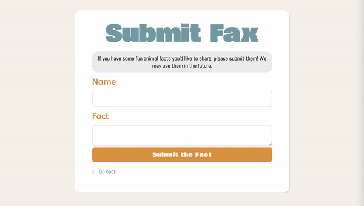
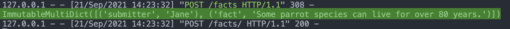
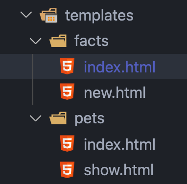

# Activity: Handling Requests and Redirecting

In the previous activity for PetFax, you added a new route for submitting a new fun fact. Of course, the form you also wrote on that page doesn't do much yet. Thankfully, we just learned how to handle incoming request bodies with user-given data. Let's use our new knowledge to save user-submitted facts to a temporary list.

## Getting Started

1. Open your terminal.
2. Navigate to [Day5/PetFax](../PetFax).
3. Open it in your code editor of choice.
4. Create the virtual environment if it does not exist.
   - `python3 -m venv venv`
5. Activate the virtual environment by running the command below for your operating system.
   - MacOS -> `. venv/bin/activate`
   - Windows -> `& .\venv\Scripts\Activate.ps1`
6. Run the app with `flask run --reload`.

## Adding a POST Method

In the last activity, in order to add a new route for submitting new fun facts, we had to create a whole new blueprint for facts. This is the blueprint we'll continue to build on for this activity.

So far, all we have is a `GET` route that goes to `/facts/new`. However, to make the form work, we need to create a `POST` route. If you recall the seven RESTful routes, the conventional endpoint to use for posting to a particular blueprint should be its base. In this case, that would mean POSTing to `/facts`.

We don't currently have that route for our fact blueprint, so let's create it.

### petfax/fact.py

Create a route on the fact blueprint that goes to "/'.
Remember, you should have already specified the URL prefix to be "/facts' when creating the blueprint, so we do not have to specify '/facts' here.
As we previously learned, the default method for routes is GET. We must specify that we want the method to be a POST.
To access any user-given data, we just learned about the request object. Be sure to import it from the flask package.
Now that we have imported it, we can use it within our POST route. For testing purposes, let's just have our route print the request.form.
To make sure our app does not error when we test it, make the route also return some sort of string. For example, "Thanks for submitting a fun fact!'

#### What your code should look like

```python
from flask import (Blueprint, render_template, request)

bp = Blueprint('fact', __name__, url_prefix="/facts")

@bp.route('/', methods=['POST'])
def index():
    print(request.form)
    return 'Thanks for submitting a fun fact!'
```

### templates/new.html

Note: If you organized your template files, it may be in a subfolder instead. Either way, find the file with the new facts form.

1. Find the form element.
2. Add an attribute for `action`. As a reminder, the value should be the endpoint to request the action on. In this case, `/facts`.
3. Add another attribute for `method`. As a reminder, the value should be the HTTP method to perform. In this case, `POST`.

#### What your code should look like

```html
<form action="/facts" method="POST">
    <!-- ... -->
</form>
```

Now we should be able to test! Go to [http://127.0.0.1:5000/facts/new](http://127.0.0.1:5000/facts/new) in your browser and submit something. If successful, you should see your string returned on the browser and the request.form dictionary in terminal with the data you just submitted. If it doesn't work, restart your Flask server and try again.

#### Browser expected output



#### Terminal expected output



## Redirecting after POST

Great, we've successfully handled a request that isn't a GET method! However, since we don't have a database set up or connected yet, we can't quite save this data. That's fine for now-at least we know how to access it.

In the meantime, before we set up a database to save this information, let's go ahead and make a placeholder `facts` index view. That way, instead of returning a random string on a blank page after POSTing a new fact, we can redirect to a proper `facts` index view that will be more useful later on.

### petfax/fact.py

1. In the index route, add GET to the methods list.
2. Now that we have two request methods that can hit this endpoint, we need to add some IF statements to properly handle each separate method. Let's make the GET route the default option. In that case, we'll need an IF statement checking if the incoming `request.method` is a POST route.
3. Properly indent our current POST route handling underneath that IF statement.
4. Outside of the IF statement, return a random string. This is just for testing purposes-later we will refactor it to render a template.
   - Note: This return will only run if the request.method is not POST.
5. To use the redirect method, we need to import it from the flask package.
6. After importing it, we can now use it in place of returning a string when handling POST requests. Have POSTs redirect to `/facts`.

#### What your code should look like

```python
from flask import (Blueprint, render_template, request, redirect)

# [ ... ]

@bp.route('/', methods=['GET', 'POST'])
def index():
    if request.method == 'POST':
        print(request.form)
        return redirect('/facts')

    return 'This is the facts index'
```

To test this, go back to [http://127.0.0.1:5000/facts/new](http://127.0.0.1:5000/facts/new) and submit the form. If successful, you should see the `facts` index string you wrote!

## Creating the Facts Index Template

Although we can't do much on a `facts` index template (considering we can't save the user-given data just yet), we can at least get it set up for that.

If you have not organized your templates into subfolders, you can now see why doing so would be useful. We want to create an index template for our fact blueprint, but we already have an `index.html` for our pet blueprint. We could just name our file `fact_index.html`, but it would be much cleaner to create subfolders. So let's do it now. If you've already done so, feel free to skip ahead to creating the new file!

### petfax/templates

1. Inside the `templates` folder, create two more folders:
   - `pets`
   - `facts`
2. Move the `index.html` and `show.html` files into the pets folder.
3. Move the `new.html` file into the `facts` folder.
4. Now, we can create a new `index.html` file within the `facts` folder without worrying about the pets one we made before!
5. In the `facts/index.html`, add a header that says "UserFax" (or something else you like).
6. Go back to the blueprint in `petfax/fact.py`.
7. In the index route for GET, change the return from returning a string to rendering the new `facts/index.html` template we just created.

#### What your code should look like

```html
<!-- [ ... ] -->
    <h1>UserFax</h1>
<!-- [ ... ] -->
```

```python
@bp.route('/', methods=['GET', 'POST'])
def index():
    if request.method == 'POST':
        print(request.form)
        return redirect('/facts')

    return render_template('facts/index.html')
```

### Templates file structure



## Conclusion

Being able to access user-submitted data is important, and thankfully, it's quite simple with Flask! However, we can't do much with that user data if we don't have a database connected to our app. In the next lesson, we will learn how to integrate a database into Flask applications.