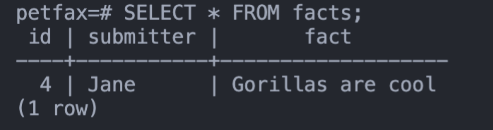
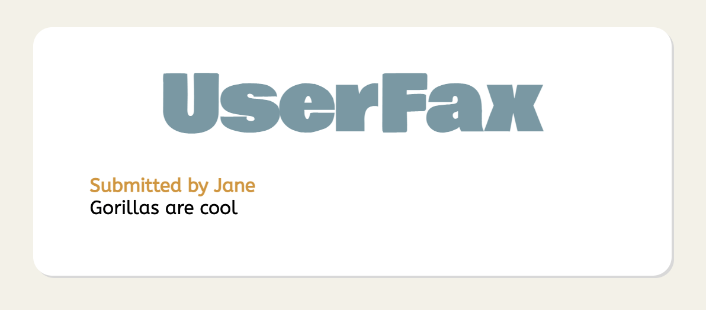

# Activity: Interacting with the PetFax Database

In the previous activity, we connected our app to a Postgres database with Flask-SQLAlchemy. In addition, we created a model for facts. However, the process for submitting new facts is still not fully functional! We have to do one more thing to make that possible: interact with the database.

In this activity, we'll finish off our initial basic prototype of PetFax. First, we'll use POST requests to insert data into our database. Second, we'll query our database for facts and render that info on the page.

## Getting Started

1. Open your terminal.
2. Navigate to [Day5/PetFax](../PetFax).
3. Open it in your code editor of choice.
4. Create the virtual environment if it does not exist.
   - `python3 -m venv venv`
5. Activate the virtual environment by running the command below for your operating system.
   - MacOS -> `. venv/bin/activate`
   - Windows -> `& .\venv\Scripts\Activate.ps1`
6. Run the app with `flask run --reload`.

## Inserting Form Data Into the Database

In a previous lesson, we learned how to retrieve form data through the Flask `request` object. Now we can combine that with our new knowledge to insert data into the database.

### petfax/fact.py

1. Find the index route.
2. Previously, we set it up to print form data by using `request.form`. For a reminder of what those data look like, go to [http://127.0.0.1:5000/facts/new](http://127.0.0.1:5000/facts/new) and submit a fact. After submitting, you should see something like the following in your terminal:
   - `ImmutableMultiDict([('submitter', 'Jane'), ('fact', 'Gorillas are cool')])`
   - This reminds us that the data come back to us as a dictionary and that the key is based on the form input name.
3. We can use those data to create a new instance of our `Fact` model, then add and commit the instance to our database.
   - To create an instance of our `Fact` model, we need to import the `models` file inside this blueprint first. Import it somewhere at the top of the file.
   - Create variables for `submitter` and `fact` and set them to their corresponding dictionary values.
   - Create a new instance of the `Fact` model, using the `submitter` and `fact` variables we just created as arguments.
   - Add the `new_fact` to the Flask-SQLAlchemy database session.
   - Commit the database session, which will insert the data into the database.
4. Now that we no longer need to see what the `request.form` body looks like, delete the print statement.

#### What your code should look like

```python
from flask import ( Blueprint, render_template, request, redirect )
from . import models

# [ ... ]

@bp.route('/', methods=['GET', 'POST'])
def index():
    if request.method == 'POST':
        submitter = request.form['submitter']
        fact      = request.form['fact']
        new_fact  = models.Fact(submitter=submitter,fact=fact)

        models.db.session.add(new_fact)
        models.db.session.commit()

        return redirect('/facts')

    return render_template('facts/index.html')
```

Now, we should be able to test this out. Go back to [http://127.0.0.1:5000/facts/new](http://127.0.0.1:5000/facts/new) and submit a fact. This time, we won't only see it in our terminal as a Python dictionary, but should also see it in our database. Using either psql or pgAdmin, check the `facts` table in the `petfax` database. If successful, you should see the fact you just submitted.



## Rendering Data Queried from the Database

Success! We have now properly interacted with our database. However, the fact index page we redirected to is still empty. This is because we haven't passed our fact index template any data to render. Let's do that next by querying our `facts` table.

### fact.py

1. Again, find the `index` route.
2. We only want to query our database when performing a GET to the fact index, not when POSTing. Be sure you are underneath and properly indented out of the `if` statement checking for POST methods.
3. Access the query object on our Fact model and retrieve `all()` rows.
4. Save the above query result to a variable named `results`.
5. Before we do any rendering, let's examine the data we get back. Loop through the results and print each individual result.

#### What your code should look like

```python
@bp.route('/', methods=['GET', 'POST'])
def index():
    if request.method == 'POST':
        submitter = request.form['submitter']
        fact      = request.form['fact']
        new_fact  = models.Fact(submitter=submitter, fact=fact)

        models.db.session.add(new_fact)
        models.db.session.commit()

        return redirect('/facts')

    results = models.Fact.query.all()

    for result in results:
        print(result)

    return render_template('facts/index.html')
```

In your browser, go to the facts index page at [http://127.0.0.1:5000/facts](http://127.0.0.1:5000/facts). In terminal, you will likely see something like:

```text
<Fact ID#>
```

That doesn't seem like very useful information at first. However, thanks to [documentation](https://flask-sqlalchemy.palletsprojects.com/en/2.x/api/#flask_sqlalchemy.BaseQuery), we know that it's an object. This means we can access the individual column values with typical dot notation, such as `result.submitter`.

This print test was still fruitful, letting us know that we successfully queried our database. Knowing that, we can move onto rendering the data.

### petfax/fact.py

1. Now that we no longer need the `for` loop, we can delete it.
2. Pass the results to the `render_template` method under a variable named `facts`.
   - Which one is the `render_template` for GET requests? The one outside of the POST if statement.

#### What your code should look like

```python
@bp.route('/', methods=['GET', 'POST'])
def index():
    if request.method == 'POST':
        submitter = request.form['submitter']
        fact      = request.form['fact']
        new_fact  = models.Fact(submitter=submitter, fact=fact)

        models.db.session.add(new_fact)
        models.db.session.commit()

        return redirect('/facts')

    results = models.Fact.query.all()

    return render_template('facts/index.html', facts=results)
```

At this point, we still won't see anything on the facts index page. We've passed the data over to the template, but we haven't told our template what to do with them. Let's do that next.

### templates/facts/index.html

1. Underneath the header, loop through the `facts` list.
   - Remember, to use Python logic within Jinja templates, you must write it with the following syntax: ``
   - Don't forget to endfor at the end to let Jinja know where the for loop should end.
   - In the `for` loop, render each fact's `submitter` and `fact`.
     - As we discussed in the previous section, we can access each column's value through dot notation.
     - Remember, to render variable information, you must write it with the following syntax: `{{ variable }}`
     - Feel free to play with the wording and styling when rendering the information.

#### What your code should look like

```html
<body>
    <div class="container">
        <H1>UserFax</H1>
        
            <H4>Submitted by {{ fact.submitter }}</H4>
            {{ fact.fact }}
        
    </div>
</body>
```

Now if you go to the index page at [http://127.0.0.1:5000/facts](http://127.0.0.1:5000/facts), you should be able to see your submitted facts rendered on the page! Note that if you don't see anything, you may have to restart your Flask server.



## Conclusion

With that, we've successfully created a basic full-stack application using a new stack! Overall, hopefully the process felt very familiar to the other stacks you've learned, with just some differences in syntax. Though we did not create a full CRUD application, you are now armed with all the knowledge and prior experience you need to do so.

If you want to challenge yourself as a bonus, consider expanding this app! For example, you can enable it will full CRUD capabilities, or you can create a second model and database table for the pets data rather than using a static JSON file.

There's just one more basic thing to learn with Flask-returning data as JSON. This will allow you to create APIs with Flask as well, rather than a server-side rendered application. As with Express, it's fairly simple now that you know all the basics. In the following activity, you will learn how to do it through self-guided learning.
