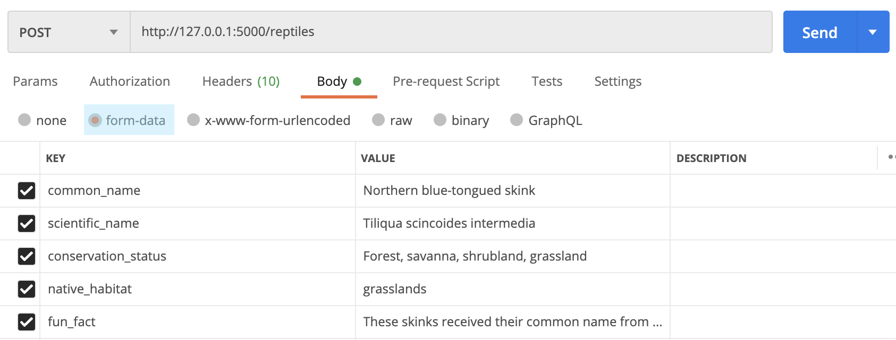

# Activity: Ball.py API

After our work with PetFax, the staff were so happy with the app that they recommended us to one of their business partners. Ball.py is a reptile zoo focused on educating the public about these oft-misunderstood animals. They've recently started up a for-hire educational program to show up at events, birthdays, and the like with some of their animals. They've been building a website to share their info and display the animals they will take to an event. However, like PetFax, they've been using hard-coded data.

As a result, they've hired us to help! However, they don't want a full-stack application because they've already worked so hard on their front end. Instead, they want us to create an API. For the prototype, they want to, at minimum, be able to add a new reptile, get a whole list of their reptiles, and get information about an individual animal.

We've already done that with PetFax, but this time, we don't need a front end! Instead of rendering templates, we'll need to respond with JSON. So before we do any coding, we should learn about how to send back JSON data with Flask.

## Creating an API with Flask

Overall, the process for creating an API with Flask is the same as we just learned:

1. Create a virtual environment.
2. Install and import `Flask`.
3. Create an application factory.
4. Import and invoke the application factory on a root `app.py` file.
5. Create the database in Postgres and configure it within the app using Flask-SQLAlchemy.
6. Create the database instance and all necessary models.
7. Create blueprints and all necessary routes.
8. Import the database models into the application factory.
9. Import and register all blueprints onto the application factory.
10. Import and install `Flask-Migrate` to migrate the database changes.
    - Don't forget to run the migration commands in your virtual environment whenever you create a new model. Forgot what the migration commands are? Look back at the previous lesson.
    - Also, don't forget to install the `psycopg2` package to allow Python to work with Postgres.

### Returning JSON

The primary difference for creating APIs is that instead of returning views, data should be returned as JSON. We've never actually learned how to return JSON, however. First, take some time to read through [this section in the documentation about how Flask handles responses](https://flask.palletsprojects.com/en/2.0.x/quickstart/#about-responses) and configure it within the app using `Flask-SQLAlchemy`. In particular, be sure to focus on the APIs with JSON portion.

1. Create the database instance and all necessary models.
2. Create blueprints and all necessary routes.
3. Import the database models into the application factory.
4. Import and register all blueprints onto the application factory.

The key takeaway there is that returning dictionaries will send data back as JSON by default. There's also a handy `jsonify()` method, but unfortunately, it does not work well with `Flask-SQLAlchemy` objects. Instead, you will have to format the Flask-SQLAlchemy objects into a dictionary that you can return. See below for an example:

```python
@bp.route('/<int:id>')
def show(id):
    user      = models.User.query.filter_by(id=id).first()
    user_dict = {
        'username': user.username
    }

    return user_dict
```

That's simple enough for a single row of data, but what about the index route? We typically want (in JSON terms) an array of objects for the index.

#### Thought Question: Returning multiple rows as JSON?

<details>
    <summary>1. Install a package to do it for me.</summary>

    Incorrect - While this is a valid solution and there are packages out there, it isn't the quickest or simplest for such a small app
</details>
<details>
    <summary>2. Return a dictionary with one key-value pair, where the value is a list of all the rows formatted as a dictionary.</summary>

    Correct! - Now how would you go about doing this? Hint: Think about defining the dictionary with an empty list value first, then use loops and append()
</details>
<details>
    <summary>3. Use the to_json() method shown in an example on the documentation.</summary>

    Incorrect - This method is not native to Python or Flask; it is part of a Python library called Pandas, which again would not be the quickest or simplest solution for our case.
</details>
<details>
    <summary>4. It's not possible.</summary>

    Incorrect
</details>

## Creating the Ball.py API
What sounds like the simplest way to return multiple rows as JSON?

Once you've learned how to return JSON data, you should be ready to get started. Listed below is the expected functionality of the API. Note that in all return cases, the data should come back in JSON format.

### Expected Functionality

1. When going to the `/reptiles` endpoint, it should return a list of all reptiles in the database.
2. When POSTing to the `/reptiles` endpoint, a new reptile should be inserted into the database.
   - Be sure to test this with Postman. See the "Testing with Postman" section below for more information.
3. When going to the `/reptiles/<id>` endpoint, it should return only the information for the reptile whose ID you queried.

### Constants

To make it easier on the Ball.py staff, they've also provided what they would like some of the constants to be named.

1. The main endpoint should be `/reptiles`.
2. The database should be named `ballpy`.
3. The table should be named `reptiles`.

Sample Data

```json
{
    "common_name":         "Ball python",
    "scientific_name":     "Python regius",
    "conservation_status": "Near threatened",
    "native_habitat":      "Forest, savanna, shrubland, grassland",
    "fun_fact":            "Ball pythons received their common name from their behavior of curling up into a ball when threatened."
}
```

### Testing with Postman

Thus far, whenever we've tested with [Postman](https://www.postman.com/downloads/), we have used raw JSON input. On the contrary, Flask expects POST requests to come in as form inputs. Instead of using raw input, use the form-data option as shown below. Additionally, be sure you test with values for each column attribute. If you don't, your POST test will show an error. Alternatively, try accounting for null values as a bonus challenge!



## Conclusion

If you get stuck along the way, don't be afraid to look back at the previous lessons and the PetFax app. Those, along with the listed steps at the beginning of this activity, should help guide you. Additionally, consider reaching out to fellow classmates!

Hopefully, you'll notice the similarities in the processes along the way.

## Acceptance Criteria

1. When running your app with `flask run --reload`, there should be no errors displayed on the browser.
2. When running and testing your API, all listed **Expected Functionality** should be functional. See the section above for exact details.

Before submitting, make sure you do a self review of your code. Check for formatting and spelling, include comments in your code, and ensure you have a healthy commit history.

Make sure to submit your GitHub link to the [BallAPI](BallAPI) directory your fork of this repo on the submission page.

## Bonus

If you completed everything but would still like more practice, consider trying out these bonus activities.

1. Make this a full REST API. Meaning, you would need to add routes for the DELETE and PUT methods.
2. `Ball.py` can only run their educational programs thanks to the professional handlers and keepers. They mentioned off-hand that a page displaying all their educational handlers and information about them would be a neat feature in the future. Surprise them by creating a second model for handlers with full CRUD capabilities and keeping info such as:
   - Their name
   - How long they've been with Ball.py
   - Their favorite reptile
   - A brief biography they could write about themselves.
3. With the handlers model, there's an opportunity to relate the reptiles model to it. Read up on [one-to-many relationships with Flask-SQLAlchemy](https://flask-sqlalchemy.palletsprojects.com/en/2.x/models/#one-to-many-relationships) and see if you can relate them together.
